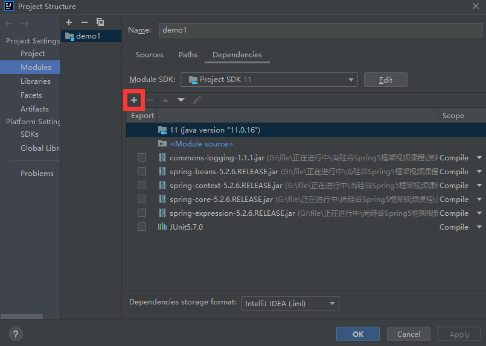

# spring 入门案例

下载 spring 相关的 jar 包

[https://repo.spring.io/release/org/springframework/spring/](https://repo.spring.io/release/org/springframework/spring/)

在 idea 中创建一个 java 工程，并引入 spring jar 包



在 src 下创建一个类

```java
package org.zgg;

public class User {
    public void add(){
        System.out.println("add..........");
    }
}
```

创建 spring 配置文件


在配置文件配置创建的对象

```xml
<?xml version="1.0" encoding="UTF-8"?>
<beans xmlns="http://www.springframework.org/schema/beans"
       xmlns:xsi="http://www.w3.org/2001/XMLSchema-instance"
       xsi:schemaLocation="http://www.springframework.org/schema/beans http://www.springframework.org/schema/beans/spring-beans.xsd">

    <!-- 配置User对象的创建-->
    <bean id="user" class="org.zgg.User"></bean>
</beans>
```

测试

```java
package org.zgg;

import org.junit.jupiter.api.Test;
import org.springframework.context.ApplicationContext;
import org.springframework.context.support.ClassPathXmlApplicationContext;

public class TestUser {
    @Test
    public void testAdd() {
        //1 加载 spring 配置文件
        ApplicationContext context = new ClassPathXmlApplicationContext("bean1.xml");
        //2 获取配置创建的对象
        User user = context.getBean("user", User.class);
        System.out.println(user);
        user.add();

        // 输出：
        // org.zgg.User@1205bd62
		// add........
    }
}
```

工程目录结构

